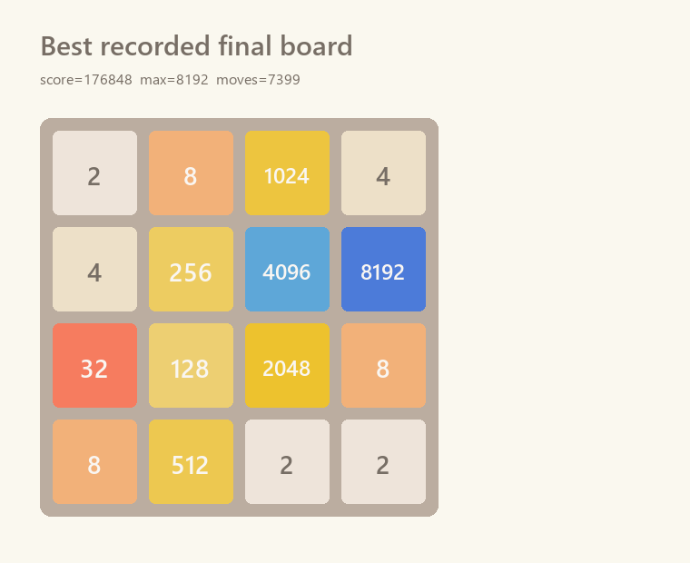
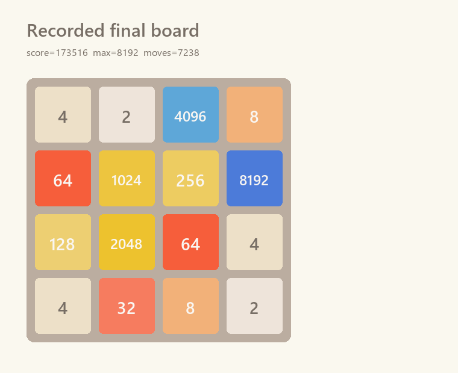

# 2048 智能体

这是一个轻量的 2048 智能体项目，包含快速的 C++ 搜索核心、实时 Tkinter 可视化界面，以及用于复盘上一局运行过程的回放工具。

- `cpp_2048_agent.cpp`：内部核心，使用 C++17 实现位棋盘与期望最大搜索。
- `live_agent.py`：实时可视化界面，负责运行 2048、调用 C++ 智能体并记录整局过程。
- `replay_agent.py`：读取上一次 `live_agent.py` 生成的记录，支持播放、暂停、上一步、下一步回放。

## 项目背景

2048 的规则很简单，但搜索空间很大。每次玩家移动后，系统会随机在空格中生成 `2` 或 `4`，因此一个优秀的智能体不能只看当前得分，还要在有限时间内评估后续随机分支的期望收益。

本项目把 2048 建模为一个带随机层的搜索问题：

```text
玩家移动层：选择上、左、下、右中的最优动作
随机生成层：枚举或采样空格中生成 2/4 的可能性
```

最终形成一个可以现场演示、可以逐步复盘的智能体小系统。

## 核心算法

### 1. 64 位位棋盘

C++ 内核将 4x4 棋盘压缩为一个 `uint64_t`。每个格子占 4 位，保存的是指数值：

```text
0 -> 0
2 -> 1
4 -> 2
...
2048 -> 11
```

这种表示能让复制、哈希、取格子、改格子都非常快，也方便作为置换表的键。

### 2. 行移动预处理

2048 的上下左右移动都可以归约为“对一行做左合并”。C++ 内核预计算全部 `2^16` 种 4 格行状态：

- 左移结果
- 右移结果
- 合并得分
- 空格数量
- 行形状评分
- 该行是否仍可移动

搜索树中最频繁的移动模拟因此变成 O(1) 表查询。

### 3. 期望最大搜索

`cpp_2048_agent.cpp` 中的搜索器执行两类递归节点：

- 玩家节点：枚举四个方向，选估值最大的动作。
- 随机节点：枚举生成位置，并按 `P(2)=0.9`、`P(4)=0.1` 求期望。

为控制分支爆炸，程序加入：

- 动态搜索深度：后期空格少或大块高时自动加深。
- 随机格限制：优先搜索靠近大块、边缘和高风险区域的生成点。
- 概率截断：概率过小的分支提前用静态估值。
- 置换表缓存：缓存重复局面。
- 时间限制：可用 `--time-ms` 限制单步思考时间。

### 4. 启发式评估

估值函数结合了多种局面特征：

- 空格数：提高生存空间。
- 行列单调性：鼓励大块沿稳定方向排列。
- 合并潜力：奖励相邻可合并块。
- 角落保护：最大块越靠角越稳定。
- 大块链保护：后期避免破坏关键结构。
- 里程碑奖励：鼓励安全地产生更大块。

## 运行环境

- Python 3.10+
- Tkinter
- C++17 编译器，Windows 下可直接使用仓库中的 `cpp_2048_agent.exe`

当前没有第三方 Python 依赖。若希望确认环境：

```powershell
python --version
```

## 运行指南

实时运行：

```powershell
python live_agent.py --exe cpp_2048_agent.exe
```

默认会自动开始。若想手动点击 `AI Step` 单步执行，或使用方向键控制：

```powershell
python live_agent.py --exe cpp_2048_agent.exe --paused
```

运行时会自动生成：

```text
last_live_replay.jsonl
```

回放上一次运行：

```powershell
python replay_agent.py
```

直接调用 C++ 内核测试单个盘面：

```powershell
.\cpp_2048_agent.exe --choose-board "2,2,0,0,4,0,0,0,0,0,0,0,0,0,0,0" --depth 3 --black-depth 5 --chance-limit 4
```

重新编译：

```powershell
g++ -O3 -std=c++17 cpp_2048_agent.cpp -o cpp_2048_agent.exe
```

运行测试：

```powershell
python -m unittest discover -s tests
```

## 随机试验

下表记录了五次随机试验结果。每次试验都由 `live_agent.py` 完整运行，使用默认智能体设置：`depth=5`、`black-depth=5`、`chance-limit=6`。

| 试验 | 随机种子 | 得分 | 最大块 | 步数 |
| ---: | ---: | ---: | ---: | ---: |
| 1 | 45801859 | 176,848 | 8,192 | 7,399 |
| 2 | 675766862 | 132,420 | 8,192 | 5,528 |
| 3 | 2113649045 | 173,516 | 8,192 | 7,238 |
| 4 | 1113023302 | 132,944 | 8,192 | 5,586 |
| 5 | 1403801325 | 168,064 | 8,192 | 6,991 |

最高分结尾盘面：



另一张保留的结尾盘面：



统计汇总：

| 指标 | 数值 |
| :--- | ---: |
| 样本数 | 5 |
| 最低分 | 132,420 |
| 平均分 | 156,758.4 |
| 中位数 | 168,064 |
| 最高分 | 176,848 |

同一组五次随机试验数据保存在 `docs/benchmark_results.json`。

## 说明

运行链路被刻意保持得很小：`live_agent.py` 调用 `cpp_2048_agent.exe --choose-board ...`，`replay_agent.py` 读取实时可视化界面写出的 JSONL 记录。旧实验、训练模型和外部表数据都不是运行所必需的内容。
